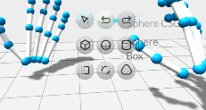
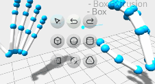
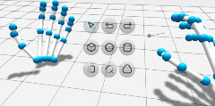
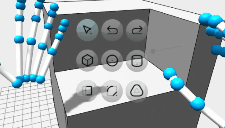
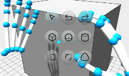
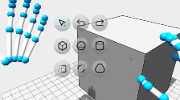

> **Note**
> Hands only compatible with OpenXR and [Tracking v5.0.0 Releases](https://developer.leapmotion.com/releases#:~:text=TRACKING%20SOFTWARE%20WINDOWS%205.0.0) and older; Enable "Allow Web Apps".

## A Simple and Powerful 3D Modelling Tool

Use simple gestures with your mouse or hands to model 3D shapes in your browser!

    
    
    

    
    
    

## Features
 - Simple Interface for working with Boxes, Spheres, Cylinders, and Extrusions
 - Powerful CSG Operations allow for infinite configurability
 - Modify Objects via Movement, Extrusion, Filleting/Chamfering, and Dilation/Hollowing
 - Snapping and Coordinate Previews for Precision Assembly
 - Model anywhere with first-class Desktop, Mobile, and VR Platform support
 - Export Models as .obj, .stl, .gltf, or .step
 - Clean and Modular ES6 codebase for extreme extensibility
 - **Free and Open Source under the Apache V2 License**

#### Future Features*
 - Draw and Extrude Custom Profiles
 - Easily Install for Offline-use as a Progressive Web App
